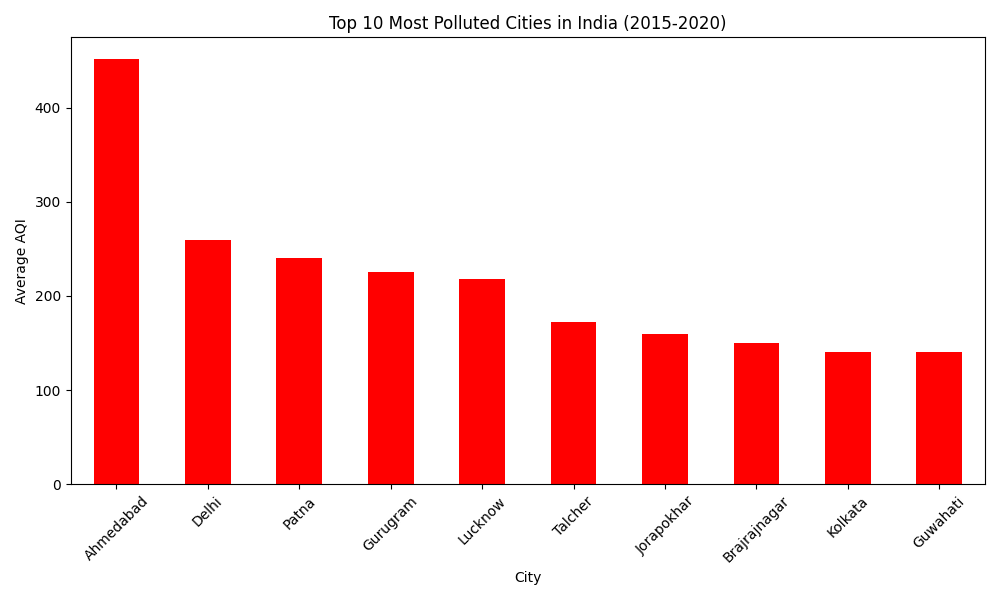
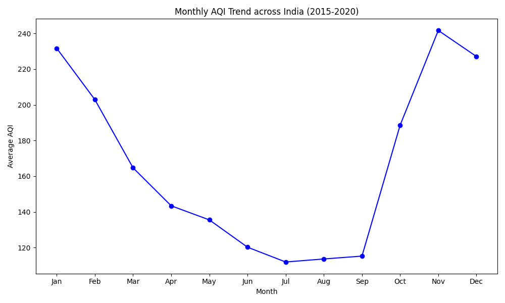
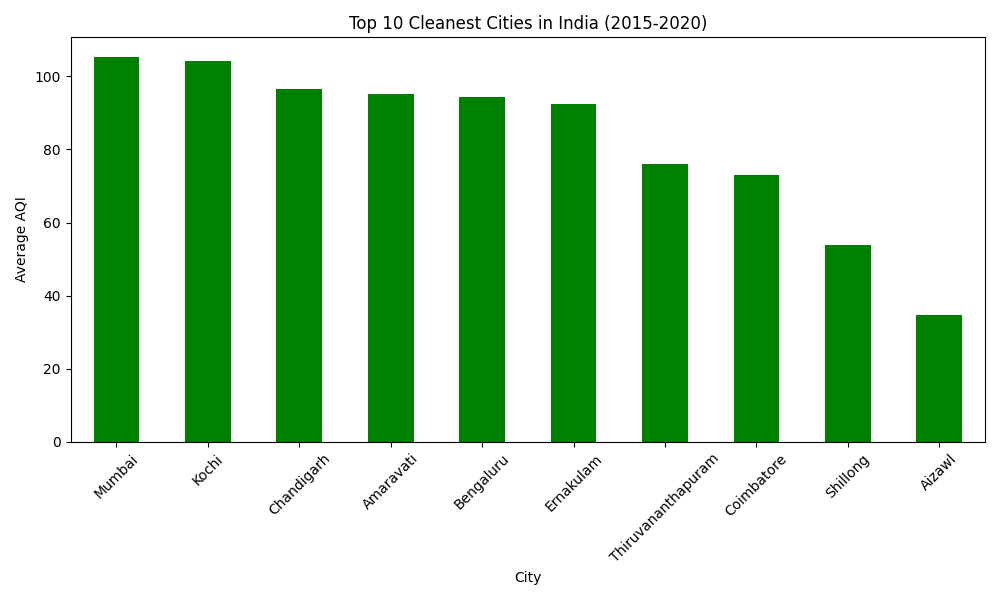

# Air Quality Index Analyser — India

A data science project analysing air pollution trends across 26 Indian cities
using five years of real government data (2015–2020).

Built by **Padma Shree** | Bengaluru, India

---

## The Problem

India is home to some of the most polluted cities on the planet.
Yet most people have no clear picture of which cities are getting worse,
which months are most dangerous, or whether the air is improving year on year.

This project uses real data from India's Central Pollution Control Board
to answer those questions — clearly, visually, and honestly.

---

## What I Found

| Question | Answer |
|----------|--------|
| Most polluted city | Ahmedabad — average AQI of 452 |
| Least polluted city | Aizawl, Mizoram — average AQI of 34 |
| Worst month of the year | November — cold air traps pollution close to the ground |
| Cleanest month of the year | July — monsoon rain washes the air clean |
| Total records analysed | 29,531 daily readings |
| Cities covered | 26 Indian cities |
| Years covered | 2015 to 2020 |

One finding that surprised me — Ahmedabad consistently outranks Delhi
as India's most polluted city. The data challenges what most people assume.

---

## Charts

### Most Polluted Cities


### Monthly AQI Trend Across India


### Cleanest Cities in India


---

## Tech Stack

| Tool | Purpose |
|------|---------|
| Python 3.13 | Core programming language |
| Pandas | Data loading, cleaning, and analysis |
| Matplotlib | Charts and visualisation |
| Seaborn | Statistical plots |

---

## How to Run This Project

```bash
# 1. Clone the repository
git clone https://github.com/Paddu2006/aqi-india-analyser.git
cd aqi-india-analyser

# 2. Install dependencies
pip install pandas matplotlib seaborn

# 3. Add the dataset
# Download city_day.csv from the link in the Data Source section
# Place it in: 05_resources/datasets/city_day.csv

# 4. Run the analysis
python notebooks/analysis.py
```

---

## Project Structure

```
aqi_india_analyser/
│
├── notebooks/
│   └── analysis.py          # Main analysis — load, clean, analyse, visualise
│
├── outputs/
│   └── charts/
│       ├── most_polluted_cities.png
│       ├── monthly_trend.png
│       └── cleanest_cities.png
│
└── README.md
```

---

## What the Code Does — Step by Step

**Step 1 — Load**
Reads 29,531 rows of daily AQI readings across 26 cities from a CSV file.

**Step 2 — Clean**
Removes 4,681 rows where AQI data was missing, leaving 24,850 complete records.

**Step 3 — Analyse**
Groups data by city and month to find averages, extremes, and trends.

**Step 4 — Visualise**
Generates three charts saved automatically as PNG files.

---

## Why This Matters

Air pollution is responsible for over 1.6 million deaths in India every year.
Most of that harm is invisible — people breathe it without knowing how dangerous
their air is on any given day.

Making this data visual and understandable is a small step toward changing that.
If this project helps even one person make a better decision about when to go outside,
or helps one policymaker see which city needs urgent attention, it has done its job.

---

## Data Source

Central Pollution Control Board (CPCB), Government of India
Available via Kaggle — Air Quality Data in India
https://www.kaggle.com/datasets/rohanrao/air-quality-data-in-india

---

## About Me

I am Padma Shree, an aspiring data scientist from Bengaluru, India.
This is the small project in my data science journey — with many more to come.

GitHub: https://github.com/Paddu2006

---

## License

MIT License — free to use, share, and build upon.
